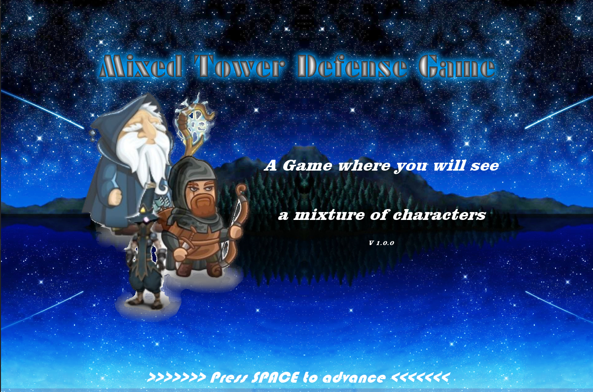

# Final Project
## Mixed Tower Defense Game
---
This game was made by the authors as a project for their CSE 210 -Pogramming with Classes- course in BYU-Idaho.

## Required Technologies
---
* Python 3.8.0
* Arcade
## NOTES:
---
* Ignore the test.py file (only testing)
* Start the game by running the __main__.py file in (project/__main__.py)

## Authors
```
    Luis Fernando Portugal  - falconbladex1@gmail.com
    Isaias Zuñiga           - zun21003@byui.edu
    Daniel Ašler            - daniel.asler007@gmail.com
```


